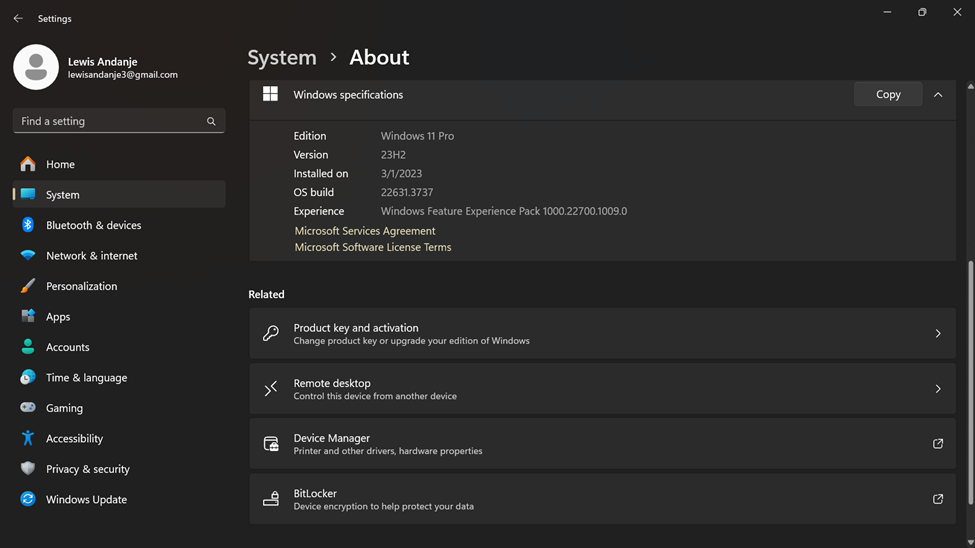
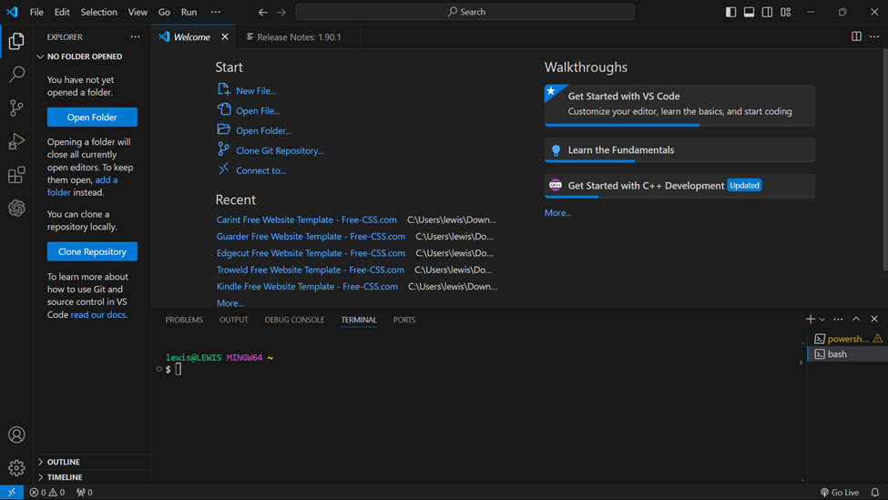
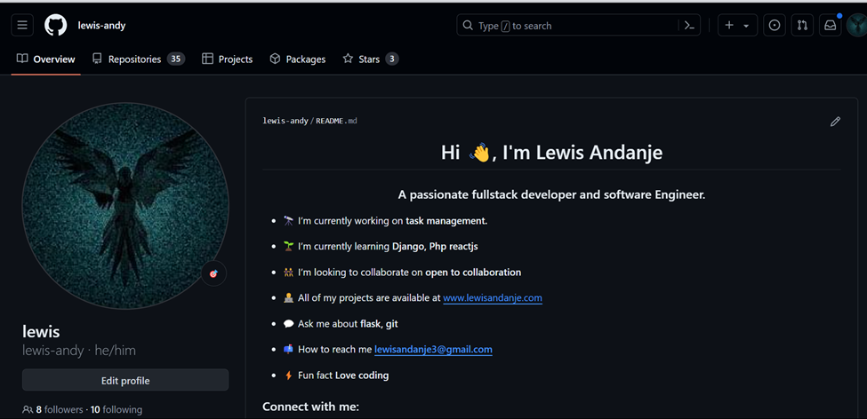
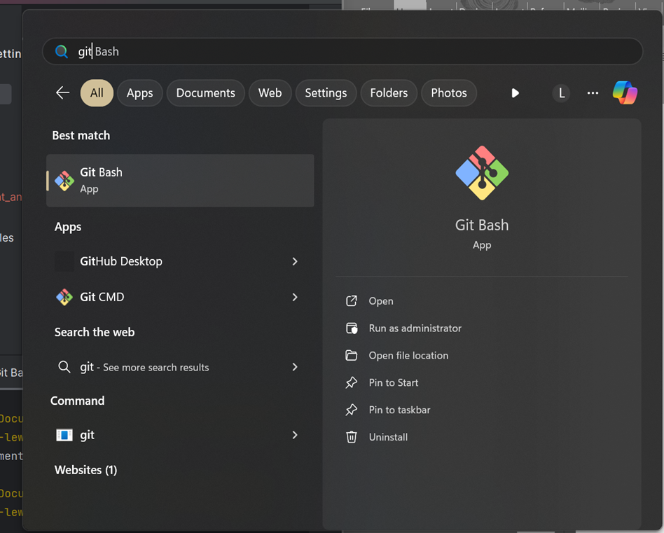
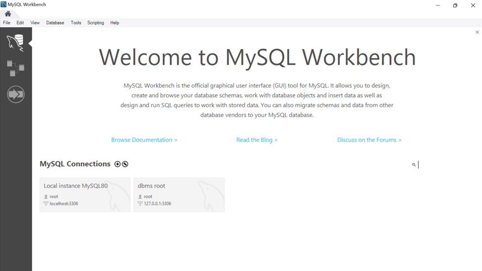
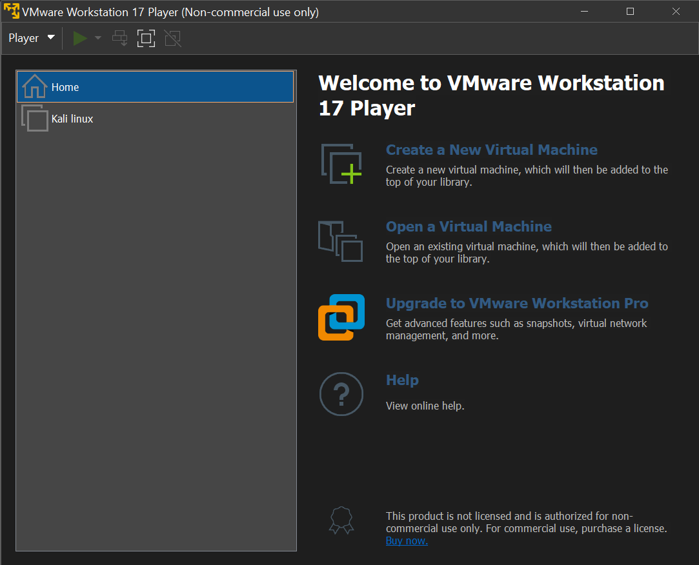
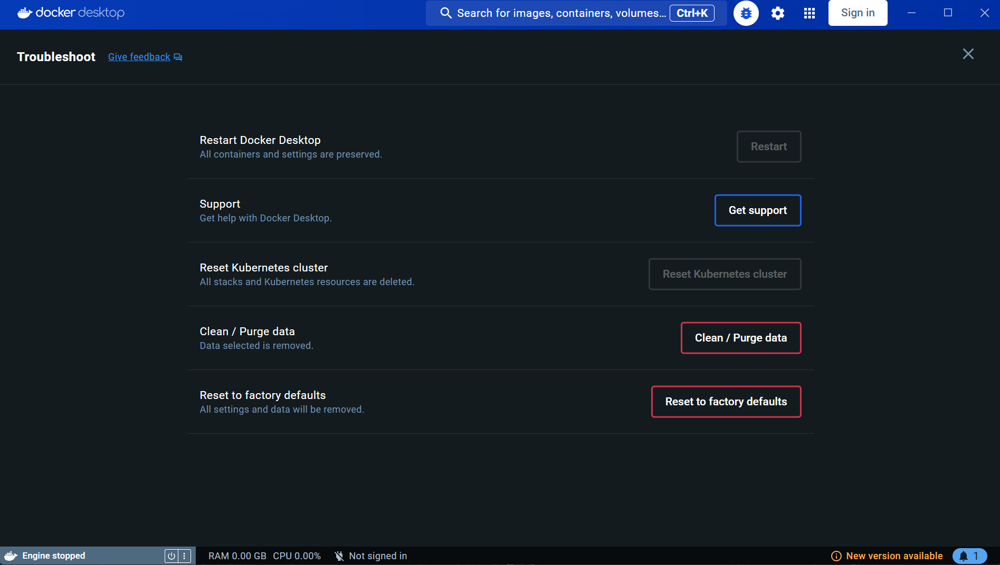

## #Assignment: Setting Up Your Developer Environment
- download and install windows(i choose to install windows 11)

- installing an IDE(intergrated development environment) I choose to install visual studio codeas per the requirements as below
and installed all the necessary extensions and plugins

- I did setup my version control system by installing git and configuring it on my local machine and created a github account for hosting my repositories

- I successfully downloaded and configured mySql database

- on setting up my development environment and virtualization  I installed docker and virtual machines to isolate project dependencies and ensure consistent environments across different machines

